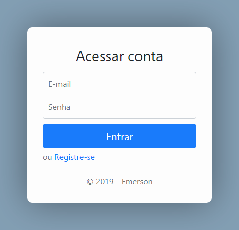

# Sistema de Login
Sistema de Login escrito em PHP que faz uso do PDO para conectar ao banco de dados. Com um visual agradável usando Bootstrap 4, este sistema de login pode facilmente ser implementado em qualquer projeto ou ser usado como base para novos. [Capturas de tela](screenshots).

## Características
- Registro de conta
- Confirmação de e-mail com código (usa o [go](https://github.com/PHPMailer/PHPMailer){:target="_blank"} para o envio de e-mails)
- Login na conta
- Ajustes na conta (alteração de nome, e-mail e/ou senha)
- Gerenciamento de contas de usuários atráves do Painel Administrativo (quando a sua conta tem permissão para isso, é claro)
- Confirmação de saída (logout)
